# Continuously Integrating Your Nix Config

**Building Automated Pipelines for Reliable System Management**

<div class="abs-br m-6 flex gap-2">
  <a href="https://github.com/joaothallis/continuously-integrating-your-nix-config" target="_blank" class="text-xl slidev-icon-btn opacity-50 !border-none text-white hover:text-gray-300">
    <carbon-logo-github />
  </a>
</div>

<!--
Welcome to the workshop! This is an interactive session where you'll learn to build automated CI/CD pipelines specifically for Nix configurations. By the end, you'll have a working pipeline that tests, builds, and validates your Nix configs on every change.
-->

---
layout: two-cols
class: text-center
---

# João Thallis 👋

<br>

## Product Engineer at

<div class="flex justify-center my-6">

</div>


::right::

# Claudio Neto 🤠

<br>

## Tech Lead at

<div class="flex justify-center my-6">

</div>

---
layout: center
---

# What's CI?

### Continuous Integration is a tool that Automatically run checks on each change you (commit) you do in a project 

---
layout: center
---

# The Problem 🔥

<v-clicks>

**Without CI/CD for Nix you can have:**
- ℹ Code not well formatted
- ❌ Broken builds
- 🐛 Dead code
- ⏰ Security vulnerabilities

</v-clicks>

<div v-after class="pt-4 text-sm opacity-75">
  Sound familiar? Let's fix this! 🛠️
</div>

<!--
These are real scenarios that Nix users face regularly. The beauty of Nix's reproducibility is only as good as our ability to validate our configurations before they reach production or other team members.
-->

---
layout: center
---

# What is Continuous Integration (CI)? 🔄

<div class="grid grid-cols-2 gap-12 mt-8">

<div>

## Traditional Development

```mermaid {scale: 0.8}
graph TD
    A[Write Code] --> B[Test Locally]
    B --> C[Manual Deploy to Production]
    C --> D[🔥 Something Breaks]
    D --> E[Debug in Production]
    E --> F[Fix & Redeploy]
```

<v-click>



</v-click>

</div>

<div>

## With CI/CD

```mermaid {scale: 0.8}
graph TD
    A[Write Code] --> B[Push to Git]
    B --> C[🤖 Automated Tests]
    C --> D[🤖 Build & Validate]
    D --> E[✅ Automatic Deploy if All Pass]
    E --> F[📈 Monitor]
```

<v-click>



</v-click>

</div>

</div>

<div v-after class="mt-8 text-center">
  <div class="text-lg text-blue-400">**CI = Automated quality checks on every code change**</div>
  <div class="text-sm opacity-75 mt-2">Catch problems early, deploy with confidence</div>
</div>

<!--
This foundational slide explains CI/CD concepts before we dive into Nix-specific implementations. The visual comparison helps participants understand the value proposition.
-->

---
layout: default
---

# CI/CD Tools & Platforms 🛠️

<div class="grid grid-cols-3 gap-x-12 gap-y-8 mt-8 px-4">
  <div class="flex flex-col items-center">
    <div class="text-5xl mb-2">🐙</div>
    <h3 class="text-xl font-bold">GitHub Actions</h3>
    <p class="text-sm text-gray-400">(cloud)</p>
  </div>
  
  <div class="flex flex-col items-center">
    <div class="text-5xl mb-2">🦊</div>
    <h3 class="text-xl font-bold">GitLab CI</h3>
    <p class="text-sm text-gray-400">(cloud/self-hosted)</p>
  </div>
  
  <div class="flex flex-col items-center">
    <div class="text-5xl mb-2">🔧</div>
    <h3 class="text-xl font-bold">Jenkins</h3>
    <p class="text-sm text-gray-400">(self-hosted)</p>
  </div>
  
  <div class="flex flex-col items-center">
    <div class="text-5xl mb-2">🏗️</div>
    <h3 class="text-xl font-bold">Buildbot</h3>
    <p class="text-sm text-gray-400">(self-hosted)</p>
  </div>
  
  <div class="flex flex-col items-center">
    <div class="text-5xl mb-2">🐦</div>
    <h3 class="text-xl font-bold">Woodpecker CI</h3>
    <p class="text-sm text-gray-400">(self-hosted)</p>
  </div>
  
  <div class="flex flex-col items-center">
    <div class="text-5xl mb-2">⭕</div>
    <h3 class="text-xl font-bold">CircleCI</h3>
    <p class="text-sm text-gray-400">(cloud)</p>
  </div>
</div>

<div class="mt-10 flex justify-center">
  <div class="px-6 py-3 bg-blue-500 bg-opacity-10 border-2 border-blue-400 rounded-lg">
    <h3 class="text-xl text-blue-400 font-bold">🎯 Today: GitHub Actions</h3>
  </div>
</div>

<!--
This slide gives participants context about available CI tools and explains our choice of GitHub Actions for the workshop. It helps them understand they have options while focusing on the most practical choice for learning.
-->

---
layout: default
---

# Nix-Native CI Tools 🔷

<div class="grid grid-cols-3 gap-x-12 gap-y-8 mt-8 px-4">
  <div class="flex flex-col items-center">
    <div class="text-5xl mb-2">🌿</div>
    <h3 class="text-xl font-bold">Garnix</h3>
    <p class="text-sm text-gray-400">garnix.io</p>
    <p class="text-xs text-gray-500">(cloud)</p>
  </div>
  
  <div class="flex flex-col items-center">
    <div class="text-5xl mb-2">⚡</div>
    <h3 class="text-xl font-bold">Hercules CI</h3>
    <p class="text-sm text-gray-400">hercules-ci.com</p>
    <p class="text-xs text-gray-500">(cloud)</p>
  </div>
  
  <div class="flex flex-col items-center">
    <div class="text-5xl mb-2">🕉️</div>
    <h3 class="text-xl font-bold">Om CI</h3>
    <p class="text-sm text-gray-400">omnix.page/om/ci</p>
    <p class="text-xs text-gray-500">(self-hosted)</p>
  </div>
  
  <div class="flex flex-col items-center">
    <div class="text-5xl mb-2">❄️</div>
    <h3 class="text-xl font-bold">NixCI</h3>
    <p class="text-sm text-gray-400">nix-ci.com</p>
    <p class="text-xs text-gray-500">(cloud)</p>
  </div>
  
  <div class="flex flex-col items-center">
    <div class="text-5xl mb-2">🐉</div>
    <h3 class="text-xl font-bold">Hydra</h3>
    <p class="text-sm text-gray-400">nixos.org/hydra</p>
    <p class="text-xs text-gray-500">(self-hosted)</p>
  </div>
  
  <div class="flex flex-col items-center">
    <div class="text-5xl mb-2">🏗️</div>
    <h3 class="text-xl font-bold">nixbuild.net</h3>
    <p class="text-sm text-gray-400">nixbuild.net</p>
    <p class="text-xs text-gray-500">(cloud)</p>
  </div>
</div>

<div class="mt-10 flex justify-center">
  <div class="px-6 py-3 bg-green-500 bg-opacity-10 border-2 border-green-400 rounded-lg">
    <h3 class="text-lg text-green-400 font-bold">Built specifically for Nix workflows</h3>
  </div>
</div>

---
layout: center
class: text-center
---

# 🚀 Time to Build!

## Let's Create Our Nix CI Pipeline

---
---

# Step 1: Basic GitHub Actions Setup

**Create `.github/workflows/ci.yml`:**

```yaml {all|1|3-5|7-9|11-14|15-17|all}
name: CI

on:
  pull_request:
  push:

jobs:
  test:
    runs-on: ubuntu-latest
    steps:
    - uses: actions/checkout@v4
    - uses: cachix/install-nix-action@v31
      with:
        nix_path: nixpkgs=channel:nixos-unstable
```

---
layout: center
layoutClass: gap-16
---

# Check Format 👔

```yaml {all|1-1|2-2|all}
- name: Check code formattingj
  run: nix run nixpkgs#alejandra -- --check .
```

---
layout: center
---

# Linter 🪮

Lints and Suggestions for the Nix programming language

```yaml {all|1-1|2-2|all}
- name: Run statix linter
  run: nix run nixpkgs#statix check
```

---
layout: center
---

# Dead Code Detector 🪦

Detects unused code in Nix projects

```yaml {all|1-1|2-2|all}
- name: Dead code detection
  run: nix run nixpkgs#deadnix -- --fail .
```

---
layout: center
layoutClass: gap-16
---

# Build Check 🏰

Let's build actual configurations to catch build issues:

```yaml {all|1-1|2-2|all}
  - run: nix build
  - run: nix-shell --run "echo OK"
```

---
layout: center
layoutClass: gap-16
---

# Nix Flake Checker ❆

Health checks for your Nix flakes

```yaml {all|1-1|2-2|all}
- name: Flake checker
  run: nix run "github:DeterminateSystems/flake-checker"
```

---
layout: center
layoutClass: gap-16
---

# Cache 💾

```yaml
    - name: Setup Cachix
      uses: cachix/cachix-action@v16
      with:
        name: nix-community
        authToken: '${{ secrets.CACHIX_AUTH_TOKEN }}'
```

---
layout: center
---

# Best Practices 💎

<v-clicks>

## Pipeline Design
- **Start simple** - Basic syntax checking first
- **Fail fast** - Put quick checks before slow builds  
- **Cache everything** - Use all available cache layers
- **Parallel jobs** - Run independent checks concurrently

## Code Organization
- **Modular configs** - Easier to test individual parts
- **Clear naming** - `hosts/laptop.nix` not `config.nix`
- **Version pins** - Pin critical dependencies (use flakes)

</v-clicks>

<!--
These practices come from real-world experience managing Nix configurations at scale. Following them will save you significant pain as your configurations grow.
-->

---
layout: center
class: text-center
---

# What's Next? 🚀

## Take Your Pipeline Further

<v-clicks>

<br>

- 📍 **Local** - Setup the CI commands in your flake file for local and CI use
- 🌐 **Deploy Automatically** - Deploy/apply changes after CI pass
- ❄ **Auto `nix flake update`** - Automatically run `nix flake update` on schedule
- ❄ **Specify which files should trigger the CI** - Only run CI when relevant files change (nix and ci file)

</v-clicks>

<div v-after class="mt-12">
  <h2 class="text-2xl text-green-400 mb-4">You now have the foundation! 🎯</h2>
  <div class="text-lg opacity-75">Start with the basics, then expand as you learn.</div>
</div>

<!--
This gives participants clear next steps after the workshop ends. The key is to start simple and gradually add complexity as they gain confidence.
-->

---
layout: center
class: text-center
---

# Thank You! 🎉

## Questions & Discussion

<div class="flex justify-center items-center gap-16 mt-12">
  <div class="text-center">
    
    <p class="text-sm text-gray-400">Workshop Slides</p>
    <p class="text-xs opacity-60">github.com/joaothallis/...</p>
  </div>
  
  <div class="text-center">
    
    <p class="text-sm text-gray-400">Example Project</p>
    <p class="text-xs opacity-60">github.com/claudionts/nix-dev</p>
  </div>
</div>

<div class="mt-8 text-sm opacity-50">
  Happy building! May your configs always evaluate successfully. ✨
</div>

<!--
A warm conclusion that reinforces the key learning outcomes and encourages continued exploration. The workshop has provided both practical skills and confidence to experiment further.
-->
